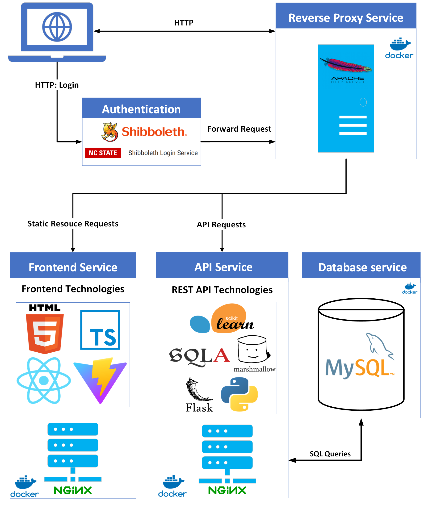
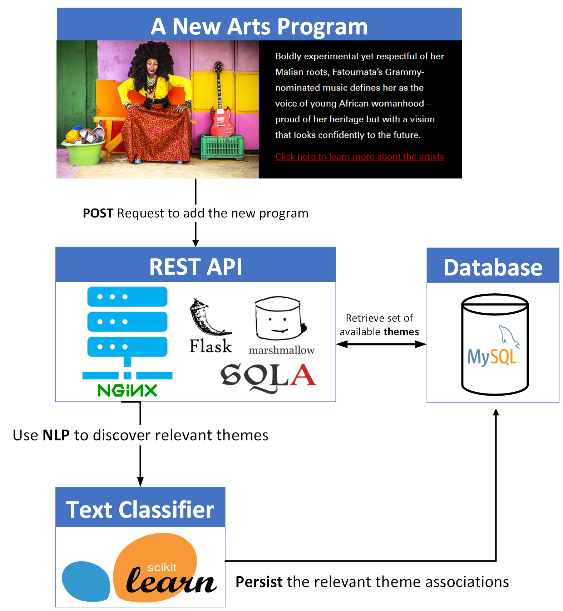

# Curricular Connections
## Project Description
In a collaborative effort with fellow senior engineering
students, implemented a full-stack application for my Senior Design Project. This innovative system
revolutionized the user experience by seamlessly integrating a searchable platform capable of autonomously
uncovering thematic relationships among university courses and upcoming arts programs, such as theater or
musical performances.

## Design
### High Level Design

### Text Classifier Diagram

## Design Description
Leveraging a client-server model, our solution integrated ReactJS for the front end, Flask for the backend, and
a MySQL database using a SQLAlchemy ORM, all of which was containerized using Docker to enhance
maintainability and availability. This application significantly improved user engagement by delivering a user-
friendly web interface tailored for NCSU students, professors, and ANCS members, streamlining access to arts
programs.

My responsibilities encompassed architecting and implementing a secure RESTful API in Python utilizing the
Flask API framework, where I managed data validation and serialization through Marshmallow.
A pivotal aspect of the project centered around automating the discovery of upcoming arts programs and
university courses. To accomplish this, I engineered a Text Classifier utilizing the SpaCy and Scikit-Learn NLP
libraries. This machine learning algorithm assigned predefined themes (e.g., Dance or Foreign Languages) to
the descriptions course and arts programs offered by the university, enabling seamless discovery of thematic
connections between them.
